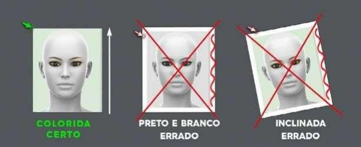

Enviei a foto errada, como faço para corrigir?
========
Para corrigir algum dado na sua licença de pescador profissional, siga as orientações abaixo:

1.Entrar no Link com login e senha da conta GOV: `https://sistemasweb.agricultura.gov.br/sap-sisrgp/`_

2.Ao abrir a tela inicial do SisRGP 4.0, deve-se clicar no link: **“a responder”**;

3.Ao abrir a nova janela, com os dados do pescador, clique sobre o nome ou CPF do
pescador;

4.Ao abrir o formulário de preenchimento com os dados do pescador, clique no botão
**“EDITAR”**;

5.No rodapé da página, clique em avançar. AVANCE TAMBÉM NAS DEMAIS PÁGINAS, até a
página de documentação;,

6.Ao abrir a página de documentação, encontre o arquivo da sua foto e clique no botão
**“remover”**.

7.Em seguida, clique no botão **“anexar”** e anexe a nova foto conforme orientação abaixo.

8.Se estiver certo, clique no botão **“ENVIAR SOLICITAÇÃO DE EDIÇÃO”**. Abrirá uma caixa
de perguntas, confirme se estiver certo. Caso contrário você poderá “cancelar solicitação
de edição”, e recomeçar.

9.Se confirmado o envio, a Superintendência Federal de Agricultura do seu Estado, fará a
análise e após as verificações você receberá um e-mail com a resposta.

Obs.: A foto tem que ser 3x4, ou seja, é só do rosto. Ela deve ser nítida e recente. Tem que ter só a foto. A IMAGEM PODE SER ANEXADA NOS FORMATOS: JPG, JPEG ou PNG.

Modelo:

Segue vídeo informativo: `https://www.youtube.com/watch?v=W19xVgfH7Is`_

.. _`https://sistemasweb.agricultura.gov.br/sap-sisrgp/`: https://sistemasweb.agricultura.gov.br/sap-sisrgp/

.. _`https://www.youtube.com/watch?v=W19xVgfH7Is`: https://www.youtube.com/watch?v=W19xVgfH7Is
